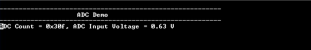

# ADC Polling

This example demonstrates how to sample an analog input in polled mode and send the converted data to console.

## Description

In this example, Analog input voltage in the range of 0 V to 3.3 V is fed to the ADC and converted value is displayed on the console. The ADC conversion is triggered by software and result is polled using status API.

## Downloading and building the application

To download or clone this application from Github, go to the [top level of the repository](https://github.com/Microchip-MPLAB-Harmony/csp_apps_sam_g55) and click

Path of the application within the repository is **apps/adc/adc_polled_mode/firmware** .

To build the application, refer to the following table and open the project using its IDE.

| Project Name      | Description                                    |
| ----------------- | ---------------------------------------------- |
| sam_g55_xpro.X | MPLABX project for [SAM G55 Xplained Pro Evaluation Kit](https://www.microchip.com/developmenttools/ProductDetails/atsamg55-xpro) |
|||

## Setting up the hardware

The following table shows the target hardware for the application projects.

| Project Name| Board|
|:---------|:---------:|
| sam_g55_xpro.X | [SAM G55 Xplained Pro Evaluation Kit](https://www.microchip.com/developmenttools/ProductDetails/atsamg55-xpro)
|||

### Setting up [SAM G55 Xplained Pro Evaluation Kit](https://www.microchip.com/developmenttools/ProductDetails/atsamg55-xpro)

- AD0 pin is used for analog input
- Use a jumper wire to connect Pin 3 of EXT1 (AD0 is mapped to Port Pin PA17) to 3.3 V or GND
- Connect the Debug USB port on the board to the computer using a micro USB cable

## Running the Application

1. Open the Terminal application (Ex.:Tera term) on the computer
2. Connect to the EDBG Virtual COM port and configure the serial settings as follows:
    - Baud : 115200
    - Data : 8 Bits
    - Parity : None
    - Stop : 1 Bit
    - Flow Control : None
3. Build and Program the application project using its IDE
4. console displays the ADC Count and the ADC Input Voltage

  
