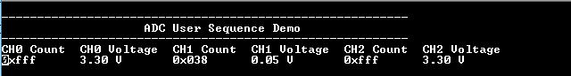

# ADC user sequence

This example demonstrates how to sample three analog inputs using the user sequencer in software trigger mode and send the converted data to the console.

## Description

Conversion of the three analog inputs is triggered from software trigger at every 500 ms. The user sequencer is used to define the order of conversion:

| Board | Sequence of conversion |
| ----- | ---------------------- |
| [SAM G55 Xplained Pro Evaluation Kit](https://www.microchip.com/developmenttools/ProductDetails/atsamg55-xpro) |  AD2 --> AD0 --> AD1 |
|||

Analog input voltage in the range of 0 V to 3.3 V is fed to the ADC input channel AD2, AD0 and AD1. ADC conversion result is displayed on the console.

## Downloading and building the application

To clone or download this application from Github, go to the [main page of this repository](https://github.com/Microchip-MPLAB-Harmony/csp_apps_sam_g55) and then click **Clone** button to clone this repository or download as zip file.
This content can also be downloaded using content manager by following these [instructions](https://github.com/Microchip-MPLAB-Harmony/contentmanager/wiki).

Path of the application within the repository is **apps/adc/adc_user_sequence/firmware** .

To build the application, refer to the following table and open the project using its IDE.

| Project Name      | Description                                    |
| ----------------- | ---------------------------------------------- |
| sam_g55_xpro.X | MPLABX project for [SAM G55 Xplained Pro Evaluation Kit](https://www.microchip.com/developmenttools/ProductDetails/atsamg55-xpro) |
|||

## Setting up the hardware

The following table shows the target hardware for the application projects.

| Project Name| Board|
|:---------|:---------:|
| sam_g55_xpro.X | [SAM G55 Xplained Pro Evaluation Kit](https://www.microchip.com/developmenttools/ProductDetails/atsamg55-xpro)
|||

### Setting up [SAM G55 Xplained Pro Evaluation Kit](https://www.microchip.com/developmenttools/ProductDetails/atsamg55-xpro)

- Use a jumper wire to connect Pin 3 of EXT1 (AD0 is mapped to Port Pin PA17) to 3.3 V or GND
- Use a jumper wire to connect Pin 4 of EXT1 (AD1 is mapped to Port Pin PA18) to 3.3 V or GND
- Use a jumper wire to connect Pin 3 of EXT3 (AD2 is mapped to Port Pin PA19) to 3.3 V or GND
- Connect the Debug USB port on the board to the computer using a micro USB cable

## Running the Application

1. Open the Terminal application (Ex.:Tera term) on the computer
2. Connect to the EDBG Virtual COM port and configure the serial settings as follows:
    - Baud : 115200
    - Data : 8 Bits
    - Parity : None
    - Stop : 1 Bit
    - Flow Control : None
3. Build and Program the application project using its IDE
4. Console displays the ADC Count and the ADC Input Voltage

  