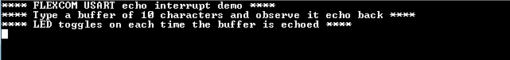

# FLEXCOM USART interrupt

This example application shows how to use the flexcom module in USART mode.

## Description

This application configures the flexcom peripheral in USART mode and performs read and write operation in a non-blocking manner. The peripheral interrupt is used to manage the transfer. It receives 10 characters from the terminal window and echoes them back.

## Downloading and building the application

To download or clone this application from Github, go to the [top level of the repository](https://github.com/Microchip-MPLAB-Harmony/csp_apps_sam_g55) and click

Path of the application within the repository is **apps/flexcom/flexcom_usart_echo_interrupt/firmware** .

To build the application, refer to the following table and open the project using its IDE.

| Project Name      | Description                                    |
| ----------------- | ---------------------------------------------- |
| sam_g55_xpro.X | MPLABX project for [SAM G55 Xplained Pro Evaluation Kit](https://www.microchip.com/developmenttools/ProductDetails/atsamg55-xpro) |
|||

## Setting up the hardware

The following table shows the target hardware for the application projects.

| Project Name| Board|
|:---------|:---------:|
| sam_g55_xpro.X | [SAM G55 Xplained Pro Evaluation Kit](https://www.microchip.com/developmenttools/ProductDetails/atsamg55-xpro)
|||

### Setting up [SAM G55 Xplained Pro Evaluation Kit](https://www.microchip.com/developmenttools/ProductDetails/atsamg55-xpro)

- Connect the debugger probe to J33 connector

## Running the Application

1. Open the Terminal application (Ex.:Tera term) on the computer
2. Connect to the EDBG Virtual COM port and configure the serial settings as follows:
    - Baud : 115200
    - Data : 8 Bits
    - Parity : None
    - Stop : 1 Bit
    - Flow Control : None
3. Build and Program the application using its IDE
4. The console displays the following message

    

5. Type 10 characters in the console
6. Entered characters will be echoed back and the LED is toggled
7. The following table provides the LED names

| Board      | LED Name                                    |
| ----------------- | ---------------------------------------------- |
| [SAM G55 Xplained Pro Evaluation Kit](https://www.microchip.com/developmenttools/ProductDetails/atsamg55-xpro)    |LED0 |
|||
