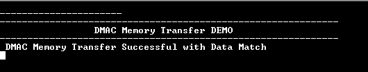

# MEM2MEM memory transfer

This application demonstrates data transfer between two memory location using MEM2MEM.

## Description

Data from the source location is transferred to the destination using MEM2MEM. Souce and destination data is compared and match is indicated by turning on the LED.

## Downloading and building the application

To download or clone this application from Github, go to the [top level of the repository](https://github.com/Microchip-MPLAB-Harmony/csp_apps_sam_g55) and click

Path of the application within the repository is **apps/mem2mem/mem2mem_memory_transfer/firmware** .

To build the application, refer to the following table and open the project using its IDE.

| Project Name      | Description                                    |
| ----------------- | ---------------------------------------------- |
| sam_g55_xpro.X | MPLABX project for [SAM G55 Xplained Pro Evaluation Kit](https://www.microchip.com/developmenttools/ProductDetails/atsamg55-xpro) |
|||

## Setting up the hardware

The following table shows the target hardware for the application projects.

| Project Name| Board|
|:---------|:---------:|
| sam_g55_xpro.X | [SAM G55 Xplained Pro Evaluation Kit](https://www.microchip.com/developmenttools/ProductDetails/atsamg55-xpro)
|||

### Setting up [SAM G55 Xplained Pro Evaluation Kit](https://www.microchip.com/developmenttools/ProductDetails/atsamg55-xpro)

- Connect the Debug USB port on the board to the computer using a micro USB cable

## Running the Application

1. Open the Terminal application (Ex.:Tera term) on the computer
2. Connect to the EDBG Virtual COM port and configure the serial settings as follows:
    - Baud : 115200
    - Data : 8 Bits
    - Parity : None
    - Stop : 1 Bit
    - Flow Control : None
3. Build and Program the application using its IDE
4. LED indicates the success or failure:
    - LED is turned ON when the memory transfer is successful.
    - Following table provides the LED name

    | Board Name | LED Name |
    |------------| -------- |
    |[SAM G55 Xplained Pro Evaluation Kit](https://www.microchip.com/developmenttools/ProductDetails/atsamg55-xpro) | LED0 |

5. Observe output message in console as follows:

    
