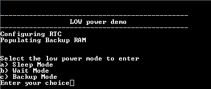
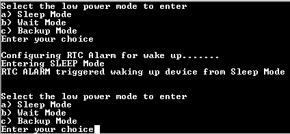
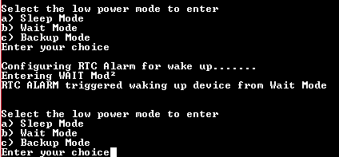
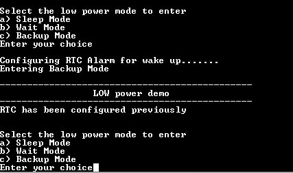

# SUPC wakeup using RTC

This example shows how to enter different low power modes and exit it using the RTC alarm.

## Description

This example demonstrates entering different low power modes, retention of the general purpose backup registers (GPBR) and backup SRAM on wakeup from backup mode through an RTC alarm.

## Downloading and building the application

To clone or download this application from Github, go to the [main page of this repository](https://github.com/Microchip-MPLAB-Harmony/csp_apps_sam_g55) and then click **Clone** button to clone this repository or download as zip file.
This content can also be downloaded using content manager by following these [instructions](https://github.com/Microchip-MPLAB-Harmony/contentmanager/wiki).

Path of the application within the repository is **apps/supc/supc_wakeup_rtc/firmware** .

To build the application, refer to the following table and open the project using its IDE.

| Project Name      | Description                                    |
| ----------------- | ---------------------------------------------- |
| sam_g55_xpro.X | MPLABX project for [SAM G55 Xplained Pro Evaluation Kit](https://www.microchip.com/developmenttools/ProductDetails/atsamg55-xpro) |
|||

## Setting up the hardware

The following table shows the target hardware for the application projects.

| Project Name| Board|
|:---------|:---------:|
| sam_g55_xpro.X | [SAM G55 Xplained Pro Evaluation Kit](https://www.microchip.com/developmenttools/ProductDetails/atsamg55-xpro)
|||

### Setting up [SAM G55 Xplained Pro Evaluation Kit](https://www.microchip.com/developmenttools/ProductDetails/atsamg55-xpro)

- Connect the Debug USB port on the board to the computer using a micro USB cable

## Running the Application

1. Open the Terminal application (Ex.:Tera term) on the computer
2. Connect to the EDBG Virtual COM port and configure the serial settings as follows:
    - Baud : 115200
    - Data : 8 Bits
    - Parity : None
    - Stop : 1 Bit
    - Flow Control : None
3. Build and Program the application project using its IDE
4. On board LED starts blinking
5. See the following message in the console

    

6. Select the option to enter the required Low power mode (LED is turned off when device enters a low power mode)
7. When the device wakes up on RTC alarm, the LED starts blinking and the console displays the following message based on the entered low power mode

    - Waking up from sleep Mode

        

    - Waking up from wait Mode

        

    - Waking up from backup Mode

        

Following table lists the name of LED used on the target board:

| Board | LED  |
| ----- | --------- |
| [SAM G55 Xplained Pro Evaluation Kit](https://www.microchip.com/developmenttools/ProductDetails/atsamg55-xpro) |LED0 |
|||
