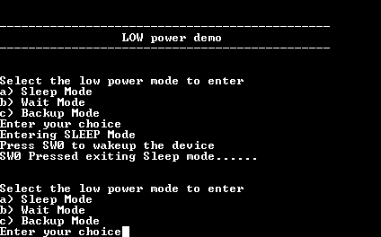

# SUPC wakeup using WKUP pin

his example shows how to enter different low power modes and exit it using WKUP pin.

## Description

This example demonstrates how to use the wakeup pin to wake up the device from low power modes.

## Downloading and building the application

To download or clone this application from Github, go to the [top level of the repository](https://github.com/Microchip-MPLAB-Harmony/csp_apps_sam_g55) and click

Path of the application within the repository is **apps/supc/supc_wakeup_wkup/firmware** .

To build the application, refer to the following table and open the project using its IDE.

| Project Name      | Description                                    |
| ----------------- | ---------------------------------------------- |
| sam_g55_xpro.X | MPLABX project for [SAM G55 Xplained Pro Evaluation Kit](https://www.microchip.com/developmenttools/ProductDetails/atsamg55-xpro) |
|||

## Setting up the hardware

The following table shows the target hardware for the application projects.

| Project Name| Board|
|:---------|:---------:|
| sam_g55_xpro.X | [SAM G55 Xplained Pro Evaluation Kit](https://www.microchip.com/developmenttools/ProductDetails/atsamg55-xpro)
|||

### Setting up [SAM G55 Xplained Pro Evaluation Kit](https://www.microchip.com/developmenttools/ProductDetails/atsamg55-xpro)

- Connect the Debug USB port on the board to the computer using a micro USB cable

## Running the Application

1. Open the Terminal application (Ex.:Tera term) on the computer
2. Connect to the EDBG Virtual COM port and configure the serial settings as follows:
    - Baud : 115200
    - Data : 8 Bits
    - Parity : None
    - Stop : 1 Bit
    - Flow Control : None
3. Build and Program the application project using its IDE
4. On board LED starts blinking
5. See the following message in the console

    

6. Select the option to enter the required Low power mode (LED is turned off when device enters a low power mode)
7. Press the switch to exit from low power mode
8. LED starts blinking and the console displays the following message based on the entered low power mode

    

Following table lists the name of LED and switch used on the target board:

| Board | LED  | Switch |
| ----- | --------- |----- |
| [SAM G55 Xplained Pro Evaluation Kit](https://www.microchip.com/developmenttools/ProductDetails/atsamg55-xpro) |LED0 | SW0 |
|||
